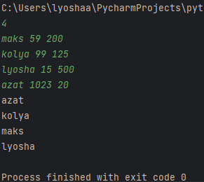
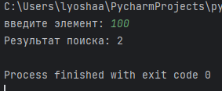
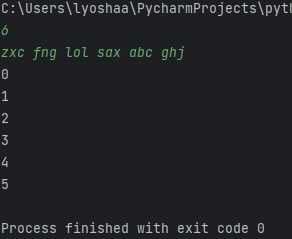
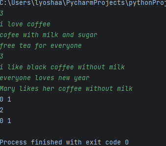
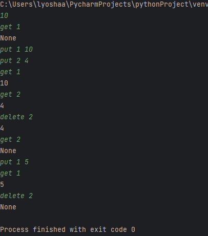
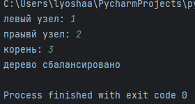

# lab10

## Задание
отсортировать участников по количеству задач, штрафу и логину с помощью быстрой сортировки

## Проделанная работа
сделана реализация быстрой сортировки по составному критерию

## Скриншоты

# lab11

## Задание
реализовать функцию, осуществляющую поиск в сломанном массиве

## Проделанная работа
Реализован бинарный поиск с учётом возможного сдвига в массиве

## Скриншоты

# lab12

## Задание
Петя решил избавиться от проблем с произношением и стать певцом. Он обратился за помощью к логопеду. Тот посоветовал Пете выполнять упражнение, которое предполагает произношение различных анаграмм. В качестве подготовительного этапа нужно выбрать из множества строк анаграммы. Анаграммы – это строки, которые получаются друг из друга перестановкой символов. Например, строки «SILENT» и «LISTEN» являются анаграммами. Помогите Пете найти анаграммы.

## Проделанная работа
Строки сгруппированы по отсортированным символам, а результаты отсортированы по условиям

## Скриншоты

# lab13

## Задание  
создать поисковую систему, возвращающую по запросу до 5 наиболее релевантных документов на основе количества вхождений слов запроса.

## Проделанная работа  
Построен обратный индекс для быстрого поиска по словам в документах, а такжде реализован алгоритм подсчёта релевантности и ранжирования этих документов

## Скриншоты  

# lab14

## Задание
Необходимо написать реализацию хеш-таблицы, чтобы хранить в ней базу данных с зарплатами сотрудников.

## Проделанная работа
создана хеш-таблица с открытой адресацией с учетом требований к реализации

## Скриншоты

# lab15

## Задание
Необходимо написать функцию, которая определяет, сбалансировано ли дерево. Дерево считается сбалансированным, если левое и правое поддеревья каждой вершины отличаются по высоте не больше, чем на единицу

## Проделанная работа
Реализована рекурсивная проверка сбалансированности с вычислением высот поддеревьев.

## Скриншоты

